# VET/VTO Workforce Forecasting & Labor Optimization

This project is an end-to-end workforce forecasting and labor planning prototype. It uses historical demand data to forecast weekly workload, generate VET/VTO/Normal staffing signals, compare model performance against baselines, and estimate potential staffing cost impact.

## Project Links

- **Interactive Tableau Story:** https://public.tableau.com/shared/JJFMGGF7Y?:display_count=n&:origin=viz_share_link
- **Streamlit App Demo:** https://warehouse-frontend-ce88.onrender.com/
- **GitHub Repository:** https://github.com/draculess99/VET-VTO-Forecasting

## Project Overview

This project is an end-to-end workforce forecasting and staffing decision support system built for a warehouse operations use case.

The system uses historical demand patterns to forecast future weekly workload and classify each week into one of three staffing actions:

- **VET** — Voluntary Extra Time, used when forecasted demand is high
- **VTO** — Voluntary Time Off, used when forecasted demand is low
- **Normal** — no major staffing adjustment needed

The project was developed as a final capstone for the Springboard Data Analytics program and is inspired by real-world warehouse labor planning challenges.

## Business Problem

Warehouse operations often face demand volatility. If labor is under-planned, the site may need overtime or risk delayed shipments. If labor is over-planned, the site may offer VTO or carry unnecessary labor cost.

The goal of this project is to improve weekly labor planning by using machine learning forecasts to support better VET/VTO decisions.

## Project Goals

The main goals are:

- Forecast weekly demand using historical sales/demand data
- Compare XGBoost performance against baseline models such as Seasonal Naive
- Convert forecasts into staffing decisions using percentile-based thresholds
- Estimate staffing cost savings compared with a baseline approach
- Build an interactive dashboard for scenario testing and business explanation

## Data Source

This project uses the Walmart weekly sales dataset as a proxy for warehouse demand.

Key fields include:

- Weekly sales
- Holiday indicator
- Temperature
- Fuel price
- CPI
- Unemployment

Because the original dataset is retail sales data, this project treats sales volume as a proxy for warehouse workload and labor demand.

Dataset source:

- Kaggle: Walmart Recruiting - Store Sales Forecasting  
  https://www.kaggle.com/c/walmart-recruiting-store-sales-forecasting/data

---

## Model Approach

The project compares baseline forecasting methods with a machine learning model.

Models considered include:

- Seasonal Naive baseline
- Moving average / simple baseline methods
- XGBoost regression model

The final system uses XGBoost because it can capture nonlinear relationships between demand, seasonality, holidays, and external variables.

## Staffing Decision Logic

After forecasting weekly demand, the system classifies each week using demand thresholds:

- Forecast above high-demand threshold → **VET**
- Forecast below low-demand threshold → **VTO**
- Forecast between thresholds → **Normal**

The thresholds are based on historical demand percentiles.

## Cost Savings Logic

The project estimates staffing cost by comparing the model-based staffing decisions against a baseline approach.

Savings are calculated as:

```python
savings = naive_cost - model_cost
cumulative_savings = savings.cumsum()
```

This allows the project to show both weekly savings and cumulative savings over time.

## Application Architecture

The project uses a two-part application structure:

```text
Streamlit frontend  <-->  Flask forecasting API
```

The Streamlit app provides the user interface, charts, scenario inputs, and business explanations.

The Flask API loads the trained model and returns forecast results, staffing decisions, and cost estimates.

## Project Structure

```text
VET-VTO-Forecasting/
│
├── README.md
├── requirements.txt
├── Dockerfile.backend
├── Dockerfile.frontend
├── docker-compose.yml
├── .gitignore
│
├── app/
│   ├── flask_forecaster.py
│   ├── streamlit_app.py
│   └── scenario_templates.tsv
│
├── data/
│   └── raw/
│       ├── features.csv
│       ├── stores.csv
│       ├── test.csv
│       ├── train.csv
│       └── README.md
│
├── models/
│   ├── warehouse_system.pkl
│   └── README.md
│
├── notebooks/
│   └── Warehouse_Workforce_Forecasting_XGBoost.ipynb
│
├── images/
│   ├── streamlit_dashboard_home.png
│   ├── forecast_output_vet_vto.png
│   ├── ai_decision_summary.png
│   ├── tableau_story_overview.png
│   ├── model_comparison_chart.png
│   └── cost_savings_chart.png
│
└── docs/
    ├── tableau_story_export.pdf
    ├── warehouse_workforce_forecasting_tableau_story.twbx
    ├──  README.md
    │
    ├── images/
    │   ├── 01_ecr_repositories_created.png
    │   ├── 02_ecs_cluster_created.png
    │   ├── 03_backend_task_definition.png
    │   ├── 04_frontend_task_definition.png
    │   ├── 05_ecs_services_running.png
    │   ├── 06_fargate_task_running.png
    │   ├── 07_live_fargate_dashboard.png
    │   └── 08_vetvto_frontend_public ip.png
    │ 
    └── architecture/
        └── system_architecture.png
```

## Example Visuals

### Streamlit Forecast Dashboard

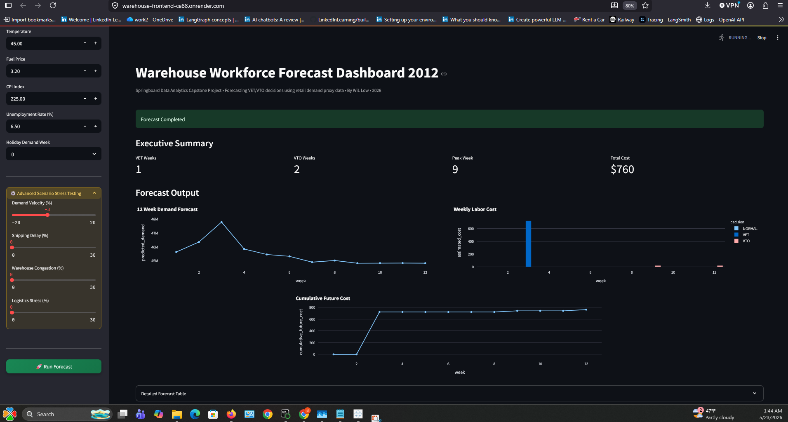

### Forecast Output and VET/VTO Signals

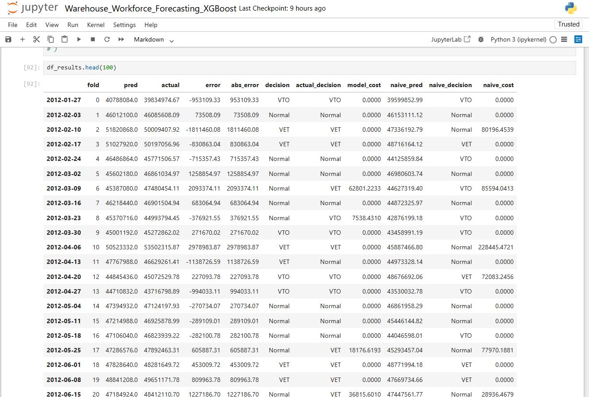

### AI Decision Summary

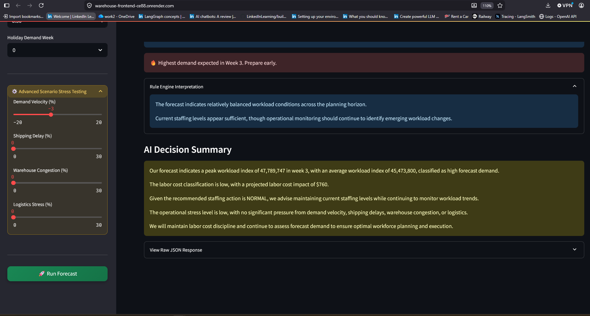

### Tableau Story Overview

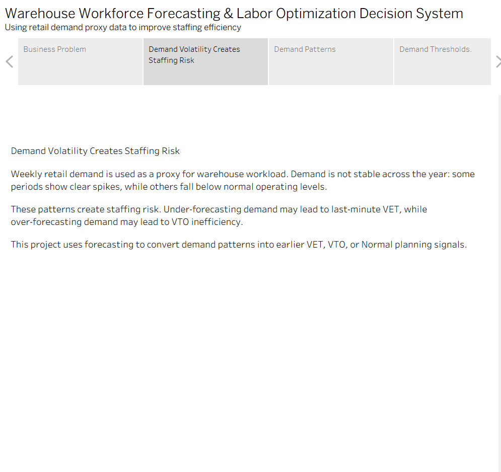

### Model Performance Comparison

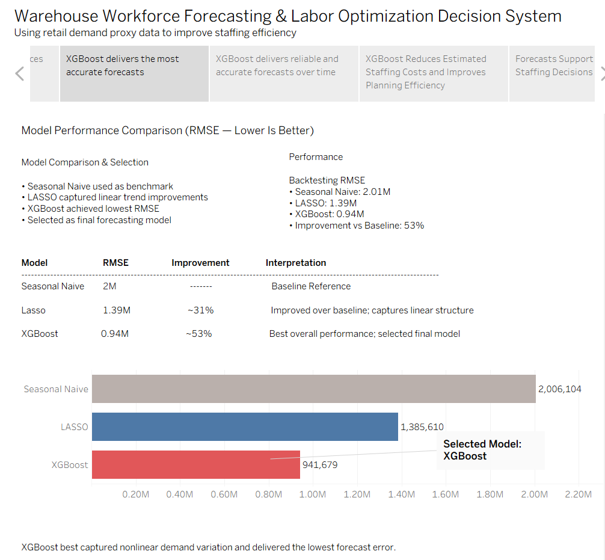

### Estimated Staffing Cost Savings

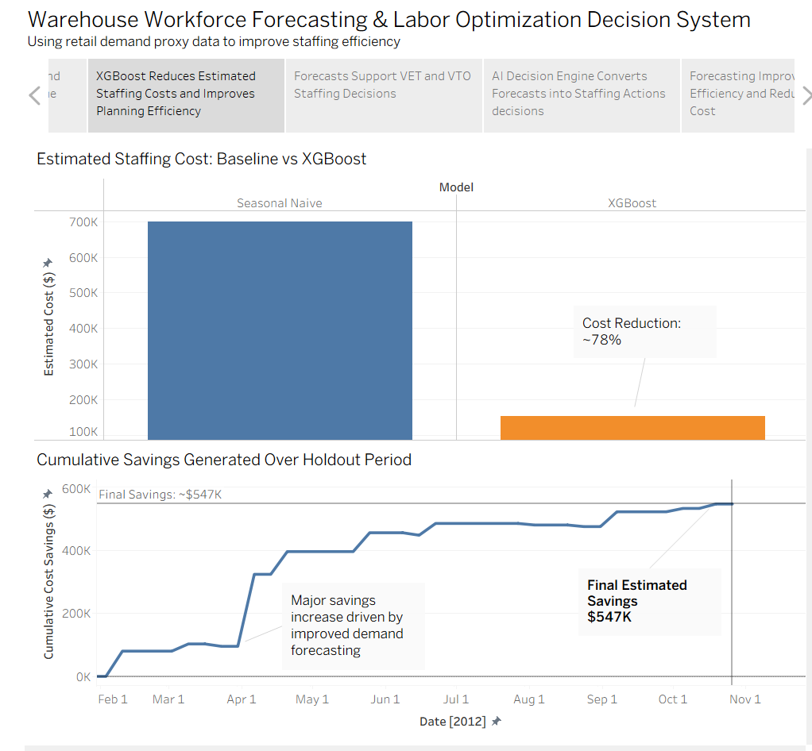


## How to Run the Project Locally

### 1. Clone the repository

```bash
git clone https://github.com/draculess99/VET-VTO-Forecasting.git
cd VET-VTO-Forecasting
```

### 2. Create and activate a virtual environment

```bash
python -m venv .venv
```

On Windows:

```bash
.venv\Scripts\activate
```

On Mac/Linux:

```bash
source .venv/bin/activate
```

### 3. Install dependencies

```bash
pip install -r requirements.txt
```

### 4. Start the Flask API

```bash
python app/flask_forecaster.py
```

### 5. Start the Streamlit app

Open a second terminal and run:

```bash
streamlit run app/streamlit_app.py
```

---

## Docker Support

This repository includes Docker files for containerized local testing and future cloud deployment.

Docker files included:

- `Dockerfile.backend`
- `Dockerfile.frontend`
- `docker-compose.yml`

To build and run both the Flask backend and Streamlit frontend with Docker Compose:

```bash
docker compose up --build
```
After startup:

- Streamlit frontend: `http://localhost:8501`
- Flask backend: `http://localhost:5000`

This Docker setup supports the future goal of deploying the base application to AWS ECS/Fargate.

## API Keys and Environment Variables

This project may use external AI services for the explanation and decision-summary layer.

If you want to enable AI-generated summaries, create a local `.env` file in the project root:

```text
GROQ_API_KEY=your_groq_api_key_here
GEMINI_API_KEY=your_gemini_api_key_here
```

## Key Outputs

The project produces:

- Weekly demand forecasts
- VET/VTO/Normal staffing recommendations
- Model vs. baseline cost comparison
- Weekly savings
- Cumulative staffing cost savings
- Interactive dashboard charts
- Business-readable explanation summaries

## Tools and Technologies

- Python
- Pandas
- NumPy
- Scikit-learn
- XGBoost
- Scikit-forecast
- Matplotlib
- Tableau
- Flask
- Streamlit
- Docker
- Docker Compose
- GitHub

## AWS Fargate Deployment

This project was containerized using Docker and deployed to AWS ECS Fargate using separate frontend and backend services.

### ECS Cluster and Services
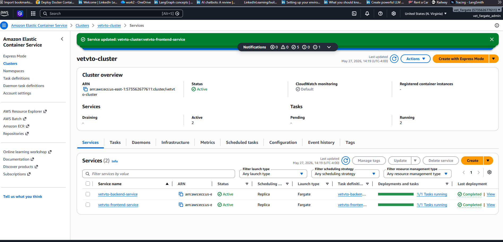

### Frontend Task Running
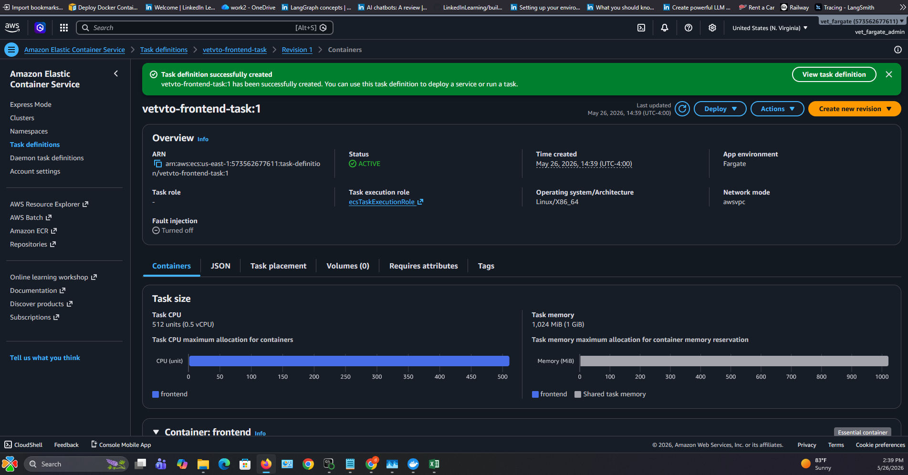

### Backend Task Definition
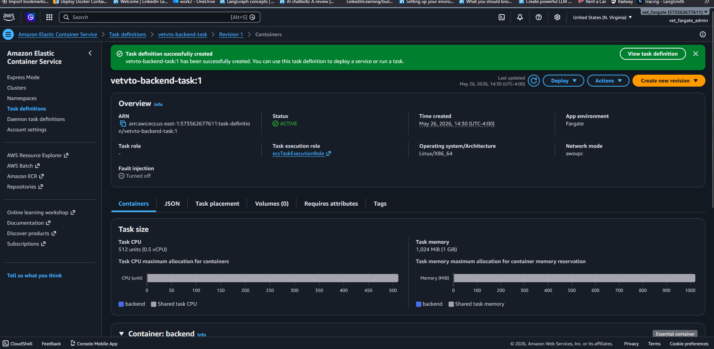

### Amazon ECR Repositories
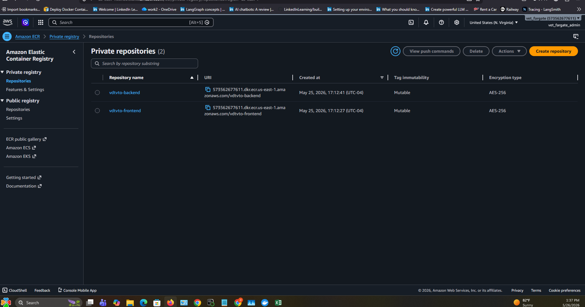

### Live Forecast Dashboard on AWS
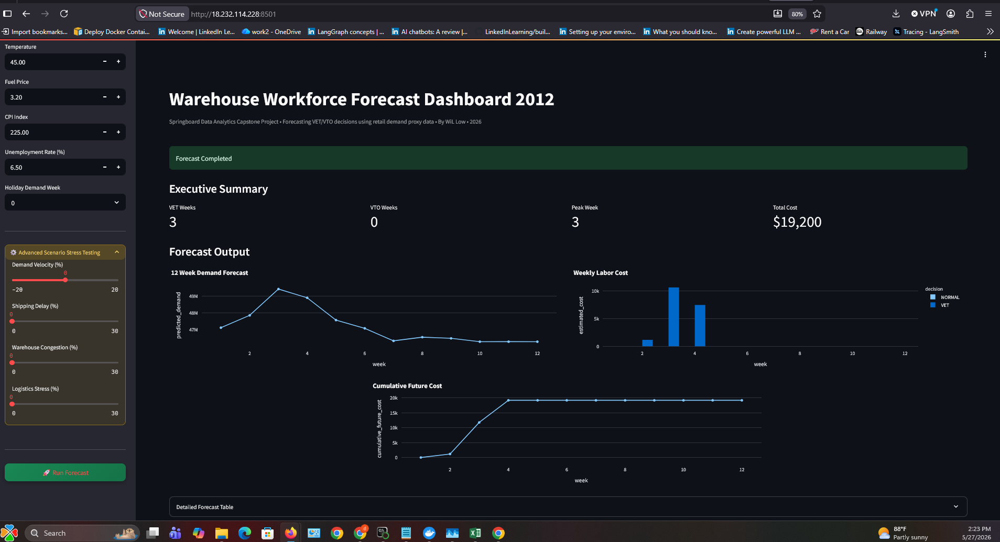

The deployment demonstrates:
- Docker containerization
- ECS service orchestration
- AWS Fargate serverless containers
- Frontend/backend microservice separation
- Cloud deployment of ML forecasting workloads

## Business Value

This project shows how machine learning can support warehouse workforce planning by improving demand forecasting, reducing staffing mismatches, and estimating labor cost savings.

The system is designed to connect technical forecasting with operational decisions that warehouse managers can understand and act on.

## Limitations

This project uses Walmart sales data as a proxy for warehouse labor demand. In a real warehouse environment, the model would be improved using actual operational data such as:

- Shipment volume
- Units processed
- Labor hours
- Headcount
- VET usage
- VTO usage
- Overtime cost
- Shift-level productivity

## Limitations and Guardrails

This project is a forecasting and decision-support prototype. It does not automate labor decisions.

VET, VTO, and Normal recommendations are generated from forecasted demand and historical threshold logic. Final staffing decisions should be reviewed by an operations manager before action.

The model uses retail demand proxy data to simulate warehouse workload patterns, so results should be interpreted as a portfolio demonstration rather than a production staffing system.

## Future Improvements

Potential future improvements include:

- Deploying the app to AWS Fargate
- Adding LangGraph or CrewAI-based explanation agents
- Adding real-time scenario planning
- Adding RAG-based documentation support
- Improving threshold logic using quarterly or seasonal demand patterns
- Connecting to live operational datasets

## Author

Created by Wil Low as part of a data analytics and machine learning Springboard portfolio 2026 project.
- **LinkedIn:** https://www.linkedin.com/in/gammaconsult/
- **GitHub Repository:** https://github.com/draculess99/VET-VTO-Forecasting
